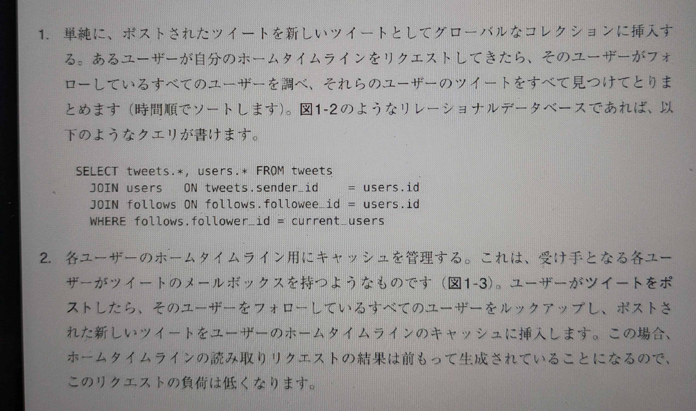
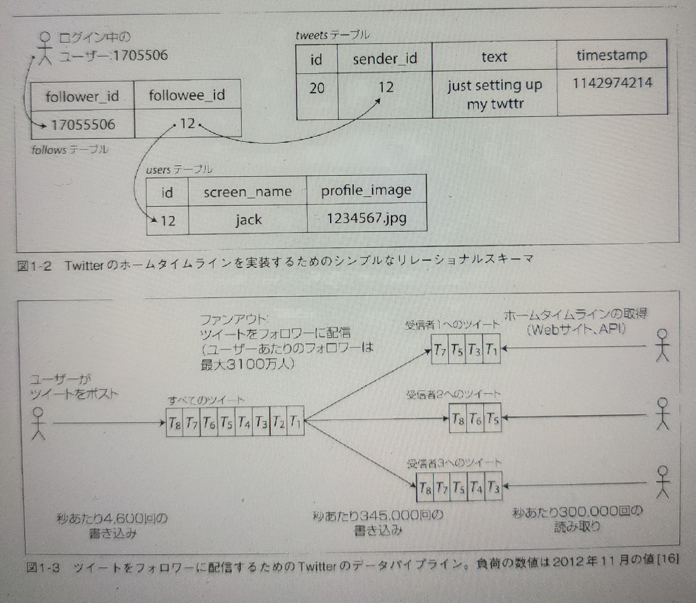

# Chapter 1

信頼性、スケーラビリティ、メンテナンス性に優れたアプリケーション

Ikeda 2022-01-21

-----

## 0 章

本書ではデータの

* 量
* 複雑さ
* 変化の速度

がボトルネックとなるアプリケーションのことをデータ指向(Data-Intensive)と呼ぶ。

-----

## 1.2 信頼性

「何か問題が生じたとしても正しく動作し続けること」

問題を起こしうるものはフォールト(fault)と呼ばれるが、フォールトは障害と同じではないことに注意。フォールトは仕様を満たしていないコンポーネントであり、障害はシステム
全体がサービスを利用するユーザーに影響を与えていること。したがって、フォールトが障害を引き起こさないような設計をする。

---

直感に反して、そういった耐障害性を持つシステムでは、意図的にフォールトを発生させることで、フォールトの割合を増加させることが理にかなっている場合がある。

例: NetflixのChaos Monkey

---

- ハードウェアのエラー → 冗長化+ソフトウェアでの耐障害性手法を使うことが主流になった
- ソフトウェアのエラー → テスト、プロセスの分離、計測、モニタリング。
- ヒューマンエラー (人間は信頼できない。)
  - エラーがでないシステム化(限界有り)
  - サンドボックス環境で実行させる
  - テスト自動化
  - 設定の変更のロールバックが即座にできる仕組みづくり
  - メトリクス, エラー発生率などモニタリングの仕組みづくり
  - 優れた管理方法とトレーニング(運用訓練)

-----

## 1.3 スケーラビリティ

「負荷の増大に対してシステムが対応できる能力」

現時点でシステムに信頼性があっても将来もそのまま信頼性を保つとは限らない。

---

負荷を表現するために **負荷のパラメータ** という数値が重要になる。

負荷のパラメータはアーキテクチャに依存する。Webサーバなら毎秒のリクエスト数、チャットルームなら同時アクティブユーザ数、キャッシュならばヒット率。

---

### Twitterのケース

- ツイート投稿 (peakが12,000リクエスト/秒 (2012年時))
- ホームのタイムライン表示 (平均300,000リクエスト/秒 (2012年時))

---

ツイート投稿とタイムライン表示の2つの処理を実装する方法は、大きく分けて2つある。

---

---

Twitterは初期は1つ目のアプローチを取っていたが、タイムラインのクエリの負荷に苦しんだ結果、2つ目のアプローチにしたところうまくいった。

平均的には、ツイート投稿数はタイムライン表示数より2桁小さかった。

---

2番目のアプローチの欠点として、ツイート投稿時のファンアウト処理が多くなる。

このときのTwitterにとって、ユーザーごとのフォロワーの分布が**負荷のパラメータ**となる。

※ Twitterは1と2のハイブリッドによって対応した。(通常ユーザーはファンアウトでインフルエンサーのツイートはグローバルDBからのクエリ)

---

### パフォーマンスの表現

レスポンスタイムは単一の数値ではなく、計測可能な**分布**として考える必要がある。

通常、より良いのはパーセンタイルを使うこと。

- 標準の値 → 50パーセンタイル値, 中央値 (median), p50
- 外れ値を見る → p95, p99, p999
  - Amazonではレスポンスタイムの要件をp999で示す。外れ値レスポンスタイムなユーザーは大口顧客であるとわかっているのでそのユーザーに満足してもらいたい。

-----

## 1.4 メンテナンス性

- 運用性
- 単純性
- 進化性

---

### 運用性

ソフトウェアをスムーズに動作させ続ける上で運用はかかせません。

- モニタリングし問題があれば素早くリカバリさせる。
- 障害の原因を発見する。
- ソフトウェアを最新に保つ。
- デプロイや設定管理などのための優れたプラクティスやツールを確立する。
- etc

---

### 単純性

- *偶発的な*複雑さを取り除く。
  - 「ビジネス自体が持ってはおらず、実装からのみ生じている複雑さ」

偶発的な複雑さを取り除く最も優れた方法が**抽象化**である。

<抽象化に基づいたサービス/モジュールの疎結合、凝集性が重要>

---

### 進化性

変更容易性。

上述の単純性が肝になる。