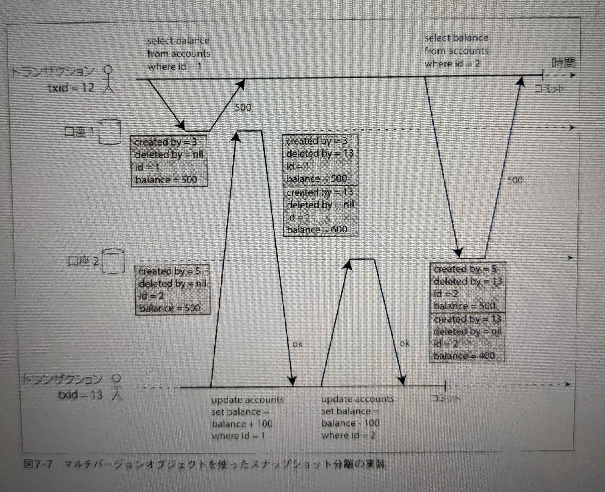
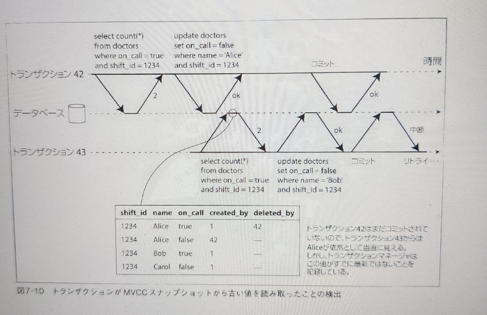

# Chapter 7 トランザクション

2022-04-01 Ikeda

-----

### 【トランザクションの存在意義】

トランザクションは抽象化レイヤーであり、アプリケーションは並行性の問題や、ハードウェア(マシン・ネットワーク障害)やソフトウェアの問題が存在しないかのようにする。

トランザクションがない場合、複雑なアクセスによってデータベースに生じる影響をアプリケーションは把握することができなくなる。

-----

### 【トランザクションは必要？不要？】

トランザクション、必要・不要という議論は浅い。トランザクションにはメリットと限界がある。それらのトレードオフを理解するためにトランザクションがもたらす保証を分解し理解する必要がある。

-----

### 7.1.1 ACIDの意味

トランザクションが持つ4つの性質としてACIDが有名である。

* 原子性 (Atonomicity)
* 一貫性 (Consistency)
* 分離性 (Isolation)
* 永続性 (Durability)

Basically Avaialbe, Soft sate, Eventual consistency の頭文字をとった**BASE**というのもある。

ACIDにもBASEにも言えるのはシステムの性質を指す言葉として曖昧であり、【ACID準拠】【BASE準拠】というのは(DBサプライヤー側の)マーケティング用語と考えて良い。

-----

### 【ここでクイズ】

原子性, 一貫性, 分離性, 永続性の中で、**データベース自体**が保証しないものはどれ？

-----

#### A. 一貫性

ACIDにおける一貫性の概念はアプリケーション固有の不変性の概念に依存しており、トランザクションを適切に定義するのはアプリケーションの責任となる。

【例】会計システムにて常に貸方と借方が等しいという保証

-----

#### 原子性

エラーの際にトランザクションを中断し、そのトランザクションすべての書き込みを破棄すること。**中断可能性(abortability)** の方が原子性よりも良い言葉だと思われる(筆者曰く)

#### 分離性

並行して実行されたトランザクションがお互いから分離されており、お互いを影響し合うことがない、という意味。

*議論における一番の主人公*👑

#### 永続性

トランザクションのコミットが成功したら、仮にハードウェアの障害があってもそのトランザクションで書き込まれたすべてのデータは失われないことを約束する、という意味。
しかし、完全な永続性は現実では存在しない。

-----

### 【分離レベルについて】

どの整合性の問題もカバーする最つよ分離レベル
→ **直列化可能分離レベル**

残念ながら、実際には直列化可能な分離性はパフォーマンス上の負担になるので、多くのDBはその負担を避けている。

もっと**弱い分離性**を提供し並行性の**一部**の問題に対する保護だけをするのがDB製品では一般的である。
→ アプリケーション開発者は保証されない部分を理解し実装する必要がある。

-----

## 弱い分離レベル

[弊Qiita記事](https://qiita.com/momotaro98/items/ad859ec2934ee98540fb)を見てみる。

X: 発生し得る(may occur)
O: 発生しない(don't occur)

|トランザクション分離レベル↓|ダーティリード|ノンリピータブルリード|ファントムリード|
|-------|:------:|:------:|:-------:|
|Read Committed|O|X|X|
|Repeatable Read|O|O|X|
|Serializable|O|O|O|

-----

### Read Committed の実装

**ダーティライト**を防ぐ実装として行ロックを実施する。
 → トランザクションがあるオブジェクト(行orドキュメント)を更新したい場合、そのオブジェクトのロックを取得し、更新が終わるまで保持する。

 **ダーティリード**を防ぐ実数として、DBが対象オブジェクトのコミット済みの古い値と、書き込みロックをしているトランザクションが設定した値の稜堡うを保持し、他のトランザクションには古い値を返す。(後述のMVCCの弱い版)。

 -----

### Repeatable Read の実装

ノンリピータブルリードは**読み取りスキュー (read skew)**とも呼ばれる。

**スナップショット分離**という解決方法が一般的に採用される。

スナップショット分離の重要な原則として、**読み取りが書き込みをブロックするすることなく、書き込みが読み取りをブロックすることもない**


-----

### スナップショット分離の実装

MVCC (Multi-Version Concurrency Control) マルチバージョン並行性制御と呼ばれる。

-----



-----

### 更新ロストの回避

* 更新ロスト
  * 残高や在庫数など、カウンタ
  * JSONの一部だけの更新

-----
#### アトミックな書き込み操作 for 更新ロストの回避

```sql
UPDATE contents SET value = value + 1 WHERE key = 'foo';
```

このような書き方にすることで read-modify-writeのサイクルを実装しなくても済むようになる。

Active RecordなどのORMはこの手をやってくれなず、意図せず問題を起こすリスクがある。

(どうやら著者はアンチORM派のようだ)

-----

#### 明示的なロック for 更新ロストの回避

```sql
BEGIN TRANSACTION;

SELECT * FROM figures
  WHERE name = 'robot' AND game_id = 222
  FOR UPDATE;

UPDATE figures SET position = 'c4' WHERE id = 1234;

COMMIT;
```

この方法はうまくいくが、アプリケーションのロジックを慎重に考慮しなければいけない。コード中に必要なロックを忘れるとレース条件を発生させてしまう。

-----


### 書き込みスキュー

ファントムリードをより抽象化した不整合を**書き込みスキュー**と呼ぶ。

---


-----

## 直列化可能なトランザクションの実装方法

#### 1. 文字通りにトランザクションを順次実行する

-----

#### 2. ツーフェーズロック (2PL)

古くからある実装。いわゆる排他ロックで読み取りも書き込みもさせないロックを取る。

→ 悲観的制御

→ パフォーマンスが悪いという欠点。

----

#### 3. 直列化可能スナップショット分離 (SSI)

2008年に出た最新アプローチ

→ COMMITする直前まで進める楽観的な並行性制御

---


