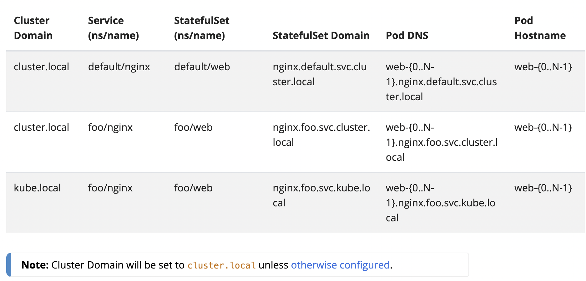

Workloadのリソースとして以下が存在する

* Deployments
* ReplicaSet
* StatefulSets
* DaemonSet
* Jobs
* Automatic Cleanup for Finished Jobs
  * A time-to-live mechanism to clean up old Jobs that have finished execution.
* CronJob
* ReplicationController

## ## [Deployments](https://kubernetes.io/docs/concepts/workloads/controllers/deployment/)

## ## [ReplicaSet](https://kubernetes.io/docs/concepts/workloads/controllers/replicaset/)

## ## [StatefulSets](https://kubernetes.io/docs/concepts/workloads/controllers/statefulset/)

> StatefulSets provides guarantees about the ordering and uniqueness of these Pods.

* StatefulSetsがDeploymentと
  * 同じところ  → コンテナImageのSpecに基づいてPodを管理する
  * 異なるところ → 各Podの"sticky identity"を管理する。リスケジュールされても"persistent identifier"を持ち続ける。

ストレージボリュームを提供したいとき、StatefulSetsは選択肢になりえる。StatefulSetsは落ちやすいにも関わらず、新しいPodは落ちたPodが持っていたVolumeにくっ付く。

### ### Using StatefulSets (StatefulSetsを使うモチベーション)

以下の要件に1つ以上当てはまる場合、StatefulSetsが選択肢になりえる。

* 安定した単一のネットワークidentifiersの提供。
* 安定した永続的なストレージ
* 順序通りのgracefulなデプロイとスケールアウト
* 順序通りの自動化されたローリングアップデート

### ### Limitations (StatefulSetsの制約)

あまり理解できていない。のでそのまま貼る。

### ### Components

```
---
apiVersion: apps/v1
kind: StatefulSet
metadata:
  name: web
spec:
  selector:
    matchLabels:
      app: nginx #
      .
      .
      .
        volumeMounts:
        - name: www
          mountPath: /usr/share/nginx/html
  volumeClaimTemplates:
  - metadata:
      name: www
    spec:
      accessModes: [ "ReadWriteOnce" ]
      storageClassName: "my-storage-class"
      resources:
        requests:
          storage: 1Gi
```

__重要↓__ → PersistentVolumes というStorageの機能と組み合わせて StatefulSets は使われる。

> The `volumeClaimTemplates` will provide stable storage using [PersistentVolumes](https://kubernetes.io/docs/concepts/storage/persistent-volumes/) provisioned by a PersistentVolume Provisioner.
> You can set the `.spec.volumeClaimTemplates` which can provide stable storage using [PersistentVolumes](https://kubernetes.io/docs/concepts/storage/persistent-volumes/) provisioned by a PersistentVolume Provisioner.

### ### Pod Identity

StatefulSets には unique identity という概念があり、ネットワークとストレージに関わる。

#### #### Ordinal Index

StatefulSets のPodがN個あるとき、0からN-1の番号がPodに振られる。v1.26からの機能で、`.spec.ordinals`と`StatefulSetStartOrdinal`の設定で任意の番号からOrdinal Indexを振ることができる。

[課題]Podが立ち上がった直後では、DNSでの解決がすぐにできない問題がある。その課題を解決するのに以下の解決方法がある。

> * Query the Kubernetes API directly (for example, using a watch) rather than relying on DNS lookups.
> * Decrease the time of caching in your Kubernetes DNS provider (typically this means editing the config map for CoreDNS, which currently caches for 30 seconds).

#### #### Stable Network ID

各StatefulSetsのPodにはStatefulSetの名前とOrdinal Indexの値のhostnameが割り振られる。`$(statefulset name)-$(ordinal)`である。 StatefulSet は [Headless Service](https://kubernetes.io/docs/concepts/services-networking/service/#headless-services)を使って自身のPodのドメインを管理することができる。

上述のLimitationに記載のとおり、StatefulSetsの利用者は[Headless Service](https://kubernetes.io/docs/concepts/services-networking/service/#headless-services)を作成する責任がある。

以下の表は StatefulSets における各リソース名の例である。



#### #### Stable Storage

上述のnginxの例において、__各Podは単一のPersistentVolumeを取得する。__ `my-storage-class`と1GitのプロビジョニングストレージのStorageClassを利用する。

PersistentVolumesはPod、StatefulSetsが削除されても残り続けるので削除する場合は手動で削除する必要がある。

#### #### Pod Name Label

StatefulSetのPodが作成されるとき、`statefulset.kubernetes.io/pod-name`のラベルがPodに付く。このラベルによりServiceをStatefulSetのPodにアタッチすることができる。

### ### Deployment and Scaling Guarantees

_Note:C_

### ### Update Strategies

`.spec.updateStrategy`によって、Rolling Updateを自動でするかしないかを設定できる。以下の2つだけがセットできる値である。

* `OnDelete`
  * 古いPodは自動で削除されない。手動でPodを削除した際に新しいPodが作られる。
* `RollingUpdate`
  * Rolling Updateを自動でする

### ### Rolling Updates

_Note:C_ Rolling Update の詳細を紹介。以下の設定がある。

`.spec.updateStrategy.rollingUpdate.partition`

`.spec.updateStrategy.rollingUpdate.maxUnavailable`

### PersistentVolumeClaim retention (FEATURE STATE: Kubernetes v1.23 [alpha])

_Note:C_ StatefulSetが利用する PersistentVolume の主に削除におけるライフサイクルを設定する。

設定したい場合は、[Feature Gates](https://kubernetes.io/docs/reference/command-line-tools-reference/feature-gates/)をEnabledにしておく必要がある。

## ## [DaemonSet](https://kubernetes.io/docs/concepts/workloads/controllers/daemonset/)

DaemonSetはノードがPodの"copy"を動作させることを保証する。ノードがクラスターに登録されたタイミングで、Podsはそのノードに追加される。また、ノードがクラスターから削除された際はそれらのPodsはガーベージコレクションされる。DaemonSetを削除することはDaemonSetによって作成されたPodsを削除することと同等である。

__DaemonSetの典型的なユースケースは以下である。__

* 各ノードに、クラスターストレージのデーモンを動作させる
* 各ノードに、ログ収集用のデーモンを動作させる
* 各ノードに、ノード監視用のデーモンを動作させる

シンプルな使い方では、1つのDaemonSetがすべてのノードでそれぞれの特定の機能のために動作する。複雑な使い方では、複数のDaemonSetを利用して単一の機能のデーモンを構成し、このとき異なるflagやメモリ、CPUを異なるハードウェアタイプとして扱う。

### ### Writing a DaemonSet Spec

#### #### Create a DaemonSet

以下はfluentd-elasticsearch Docker imageを実行するDaemonSetのマニフェストである。

```yaml
apiVersion: apps/v1
kind: DaemonSet
metadata:
  name: fluentd-elasticsearch
  namespace: kube-system
  labels:
    k8s-app: fluentd-logging
spec:
  selector:
    matchLabels:
      name: fluentd-elasticsearch
  template:
    metadata:
      labels:
        name: fluentd-elasticsearch
    spec:
      tolerations:
      # these tolerations are to have the daemonset runnable on control plane nodes
      # remove them if your control plane nodes should not run pods
      - key: node-role.kubernetes.io/control-plane
        operator: Exists
        effect: NoSchedule
      - key: node-role.kubernetes.io/master
        operator: Exists
        effect: NoSchedule
      containers:
      - name: fluentd-elasticsearch
        image: quay.io/fluentd_elasticsearch/fluentd:v2.5.2
        resources:
        .
        .
        .
```

### ### How Daemon Pods are scheduled

DaemonSetは適任のノードがPodのcopyを実行させることを保証する。DaemonSetコントローラは`spec.affinity.nodeAffinity`を作成したPodに付与して適切なノード上で動作させるようにする事前準備をする。その後のPodの管理はdefault schedulerが引き継ぎ、`.spec.nodeName`をPodに付与することでPodを具体なノードで動作させるようにする。もしPodにフィットするノードが見つからない場合、[PodのPriority](https://kubernetes.io/docs/concepts/scheduling-eviction/pod-priority-preemption/#pod-priority)に基づいて既存のPodが"preempt(evict)"される場合がある。

`.spec.template.spec.schedulerName`を指定することで異なったDaemonSetのスケジューラを選択することができる。

`.spec.template.spec.affinity.nodeAffinity`フィールドで事前に指定された内容はコントローラによって考慮され、実際にPodが対象ノードで動くときにフィールドの値は実際のノード名に置き換わる。

#### #### Taints and tolerations

DaemonSetコントローラは自動で以下のような"[tolerations](https://kubernetes.io/docs/concepts/scheduling-eviction/taint-and-toleration/)"をPodに付与することで制御を行う。

| Toleration key                       | Effect     | Details                                                                                                                                                           |
| ------------------------------------ | ---------- | ----------------------------------------------------------------------------------------------------------------------------------------------------------------- |
| node.kubernetes.io/not-ready         | NoExecute  | DaemonSet Pods can be scheduled onto nodes that are not healthy or ready to accept Pods. Any DaemonSet Pods running on such nodes will not be evicted.             |
| node.kubernetes.io/unreachable       | NoExecute  | DaemonSet Pods can be scheduled onto nodes that are unreachable from the node controller. Any DaemonSet Pods running on such nodes will not be evicted.           |
| node.kubernetes.io/disk-pressure     | NoSchedule | DaemonSet Pods can be scheduled onto nodes with disk pressure issues.                                                                                               |
| node.kubernetes.io/memory-pressure   | NoSchedule | DaemonSet Pods can be scheduled onto nodes with memory pressure issues.                                                                                             |
| node.kubernetes.io/pid-pressure      | NoSchedule | DaemonSet Pods can be scheduled onto nodes with process pressure issues.                                                                                            |
| node.kubernetes.io/unschedulable     | NoSchedule | DaemonSet Pods can be scheduled onto nodes that are unschedulable.                                                                                                  |
| node.kubernetes.io/network-unavailable | NoSchedule | Only added for DaemonSet Pods that request host networking, i.e., Pods having spec.hostNetwork: true. Such DaemonSet Pods can be scheduled onto nodes with unavailable network. |


また、カスタマイズなtolerationsを定義することができる。

DaemonSetコントローラが`node.kubernetes.io/unschedulable:NoSchedule`を付与しているため、Kubernetes can run DaemonSet Pods on nodes that are marked as unschedulable.

もし、DaemonSetを[cluster networking](https://kubernetes.io/docs/concepts/cluster-administration/networking/)のようなノードレベルの重要な機能に利用するような場合、ノードへのtolerationsを利用することで、ノードの準備とネットワークの準備の互いのデッドロックを防ぎ、ネットワークがセットされてからノードがセットされることを保証するようにできる。

### ### Communicating with Daemon Pods

ここから

## ## [Jobs](https://kubernetes.io/docs/concepts/workloads/controllers/job/)

## ## [Automatic Cleanup for Finished Jobs](https://kubernetes.io/docs/concepts/workloads/controllers/ttlafterfinished/)

## ## [CronJob](https://kubernetes.io/docs/concepts/workloads/controllers/cron-jobs/)

## ## [ReplicationController](https://kubernetes.io/docs/concepts/workloads/controllers/replicationcontroller/)