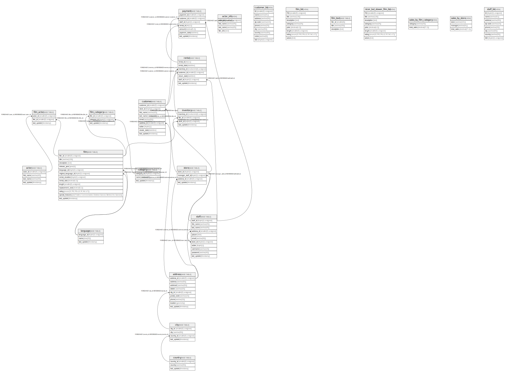

# sakila

## Tables

| Name | Columns | Comment | Type |
| ---- | ------- | ------- | ---- |
| [actor](actor.md) | 4 |  | BASE TABLE |
| [actor_info](actor_info.md) | 4 | VIEW | VIEW |
| [address](address.md) | 9 |  | BASE TABLE |
| [category](category.md) | 3 |  | BASE TABLE |
| [city](city.md) | 4 |  | BASE TABLE |
| [country](country.md) | 3 |  | BASE TABLE |
| [customer](customer.md) | 9 |  | BASE TABLE |
| [customer_list](customer_list.md) | 9 | VIEW | VIEW |
| [film](film.md) | 13 |  | BASE TABLE |
| [film_actor](film_actor.md) | 3 |  | BASE TABLE |
| [film_category](film_category.md) | 3 |  | BASE TABLE |
| [film_list](film_list.md) | 8 | VIEW | VIEW |
| [film_text](film_text.md) | 3 |  | BASE TABLE |
| [inventory](inventory.md) | 4 |  | BASE TABLE |
| [language](language.md) | 3 |  | BASE TABLE |
| [nicer_but_slower_film_list](nicer_but_slower_film_list.md) | 8 | VIEW | VIEW |
| [payment](payment.md) | 7 |  | BASE TABLE |
| [rental](rental.md) | 7 |  | BASE TABLE |
| [sales_by_film_category](sales_by_film_category.md) | 2 | VIEW | VIEW |
| [sales_by_store](sales_by_store.md) | 3 | VIEW | VIEW |
| [staff](staff.md) | 11 |  | BASE TABLE |
| [staff_list](staff_list.md) | 8 | VIEW | VIEW |
| [store](store.md) | 4 |  | BASE TABLE |

## Stored procedures and functions

| Name | ReturnType | Arguments | Type |
| ---- | ------- | ------- | ---- |
| film_in_stock |  | p_film_id int; p_store_id int; p_film_count int | PROCEDURE |
| film_not_in_stock |  | p_film_id int; p_store_id int; p_film_count int | PROCEDURE |
| get_customer_balance | decimal | p_customer_id int; p_effective_date datetime | FUNCTION |
| inventory_held_by_customer | int | p_inventory_id int | FUNCTION |
| inventory_in_stock | tinyint | p_inventory_id int | FUNCTION |
| rewards_report |  | min_monthly_purchases tinyint; min_dollar_amount_purchased decimal; count_rewardees int | PROCEDURE |

## Relations

---

> Generated by [tbls](https://github.com/k1LoW/tbls)
