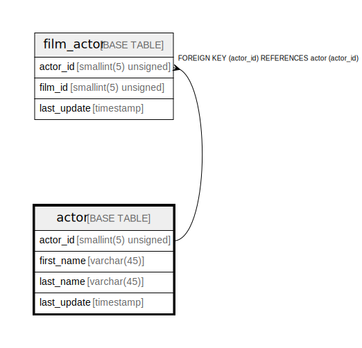

# actor

## Description

<details>
<summary><strong>Table Definition</strong></summary>

```sql
CREATE TABLE `actor` (
  `actor_id` smallint(5) unsigned NOT NULL AUTO_INCREMENT,
  `first_name` varchar(45) NOT NULL,
  `last_name` varchar(45) NOT NULL,
  `last_update` timestamp NOT NULL DEFAULT CURRENT_TIMESTAMP ON UPDATE CURRENT_TIMESTAMP,
  PRIMARY KEY (`actor_id`),
  KEY `idx_actor_last_name` (`last_name`)
) ENGINE=InnoDB AUTO_INCREMENT=[Redacted by tbls] DEFAULT CHARSET=utf8mb4
```

</details>

## Columns

| Name | Type | Default | Nullable | Extra Definition | Children | Parents | Comment |
| ---- | ---- | ------- | -------- | ---------------- | -------- | ------- | ------- |
| actor_id | smallint(5) unsigned |  | false | auto_increment | [film_actor](film_actor.md) |  |  |
| first_name | varchar(45) |  | false |  |  |  |  |
| last_name | varchar(45) |  | false |  |  |  |  |
| last_update | timestamp | CURRENT_TIMESTAMP | false | on update CURRENT_TIMESTAMP |  |  |  |

## Constraints

| Name | Type | Definition |
| ---- | ---- | ---------- |
| PRIMARY | PRIMARY KEY | PRIMARY KEY (actor_id) |

## Indexes

| Name | Definition |
| ---- | ---------- |
| idx_actor_last_name | KEY idx_actor_last_name (last_name) USING BTREE |
| PRIMARY | PRIMARY KEY (actor_id) USING BTREE |

## Relations



---

> Generated by [tbls](https://github.com/k1LoW/tbls)
