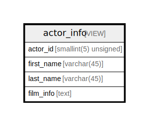

# actor_info

## Description

VIEW

<details>
<summary><strong>Table Definition</strong></summary>

```sql
CREATE VIEW actor_info AS (select `a`.`actor_id` AS `actor_id`,`a`.`first_name` AS `first_name`,`a`.`last_name` AS `last_name`,group_concat(distinct concat(`c`.`name`,': ',(select group_concat(`f`.`title` order by `f`.`title` ASC separator ', ') from ((`sakila`.`film` `f` join `sakila`.`film_category` `fc` on((`f`.`film_id` = `fc`.`film_id`))) join `sakila`.`film_actor` `fa` on((`f`.`film_id` = `fa`.`film_id`))) where ((`fc`.`category_id` = `c`.`category_id`) and (`fa`.`actor_id` = `a`.`actor_id`)))) order by `c`.`name` ASC separator '; ') AS `film_info` from (((`sakila`.`actor` `a` left join `sakila`.`film_actor` `fa` on((`a`.`actor_id` = `fa`.`actor_id`))) left join `sakila`.`film_category` `fc` on((`fa`.`film_id` = `fc`.`film_id`))) left join `sakila`.`category` `c` on((`fc`.`category_id` = `c`.`category_id`))) group by `a`.`actor_id`,`a`.`first_name`,`a`.`last_name`)
```

</details>

## Referenced Tables

- [film](film.md)
- [film_category](film_category.md)
- [film_actor](film_actor.md)
- [actor](actor.md)
- [category](category.md)

## Columns

| Name | Type | Default | Nullable | Children | Parents | Comment |
| ---- | ---- | ------- | -------- | -------- | ------- | ------- |
| actor_id | smallint(5) unsigned | 0 | false |  |  |  |
| first_name | varchar(45) |  | false |  |  |  |
| last_name | varchar(45) |  | false |  |  |  |
| film_info | text |  | true |  |  |  |

## Relations



---

> Generated by [tbls](https://github.com/k1LoW/tbls)
