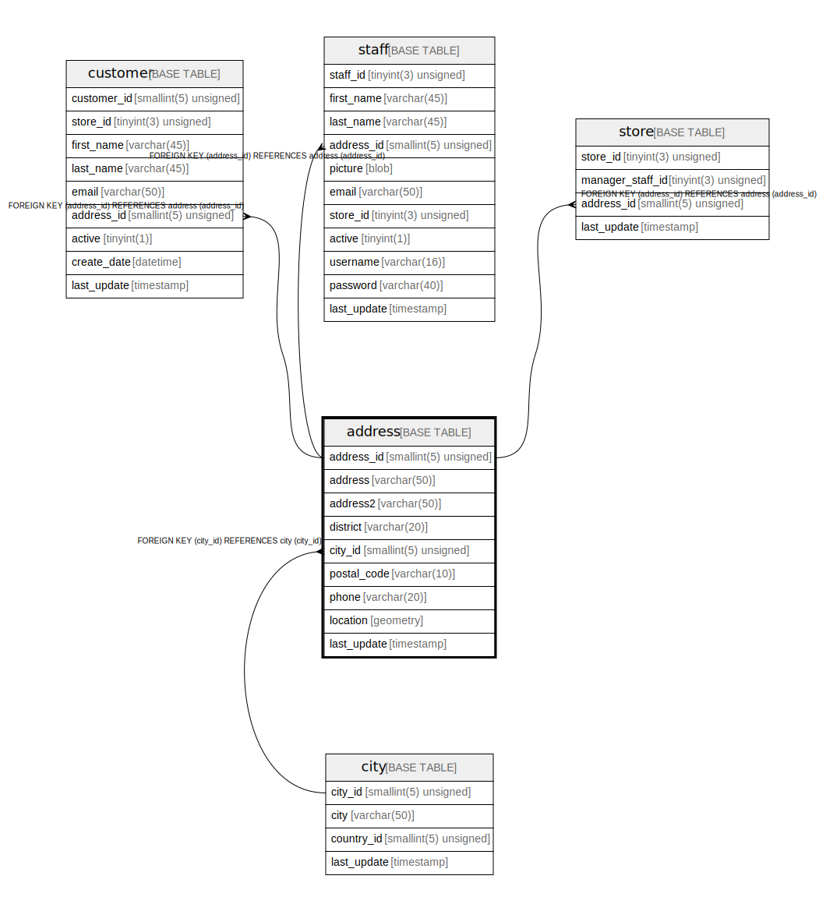

# address

## Description

<details>
<summary><strong>Table Definition</strong></summary>

```sql
CREATE TABLE `address` (
  `address_id` smallint(5) unsigned NOT NULL AUTO_INCREMENT,
  `address` varchar(50) NOT NULL,
  `address2` varchar(50) DEFAULT NULL,
  `district` varchar(20) NOT NULL,
  `city_id` smallint(5) unsigned NOT NULL,
  `postal_code` varchar(10) DEFAULT NULL,
  `phone` varchar(20) NOT NULL,
  `location` geometry NOT NULL,
  `last_update` timestamp NOT NULL DEFAULT CURRENT_TIMESTAMP ON UPDATE CURRENT_TIMESTAMP,
  PRIMARY KEY (`address_id`),
  KEY `idx_fk_city_id` (`city_id`),
  SPATIAL KEY `idx_location` (`location`),
  CONSTRAINT `fk_address_city` FOREIGN KEY (`city_id`) REFERENCES `city` (`city_id`) ON UPDATE CASCADE
) ENGINE=InnoDB AUTO_INCREMENT=[Redacted by tbls] DEFAULT CHARSET=utf8mb4
```

</details>

## Columns

| Name | Type | Default | Nullable | Extra Definition | Children | Parents | Comment |
| ---- | ---- | ------- | -------- | ---------------- | -------- | ------- | ------- |
| address_id | smallint(5) unsigned |  | false | auto_increment | [customer](customer.md) [staff](staff.md) [store](store.md) |  |  |
| address | varchar(50) |  | false |  |  |  |  |
| address2 | varchar(50) |  | true |  |  |  |  |
| district | varchar(20) |  | false |  |  |  |  |
| city_id | smallint(5) unsigned |  | false |  |  | [city](city.md) |  |
| postal_code | varchar(10) |  | true |  |  |  |  |
| phone | varchar(20) |  | false |  |  |  |  |
| location | geometry |  | false |  |  |  |  |
| last_update | timestamp | CURRENT_TIMESTAMP | false | on update CURRENT_TIMESTAMP |  |  |  |

## Constraints

| Name | Type | Definition |
| ---- | ---- | ---------- |
| fk_address_city | FOREIGN KEY | FOREIGN KEY (city_id) REFERENCES city (city_id) |
| PRIMARY | PRIMARY KEY | PRIMARY KEY (address_id) |

## Indexes

| Name | Definition |
| ---- | ---------- |
| idx_fk_city_id | KEY idx_fk_city_id (city_id) USING BTREE |
| idx_location | KEY idx_location (location) USING SPATIAL |
| PRIMARY | PRIMARY KEY (address_id) USING BTREE |

## Relations



---

> Generated by [tbls](https://github.com/k1LoW/tbls)
