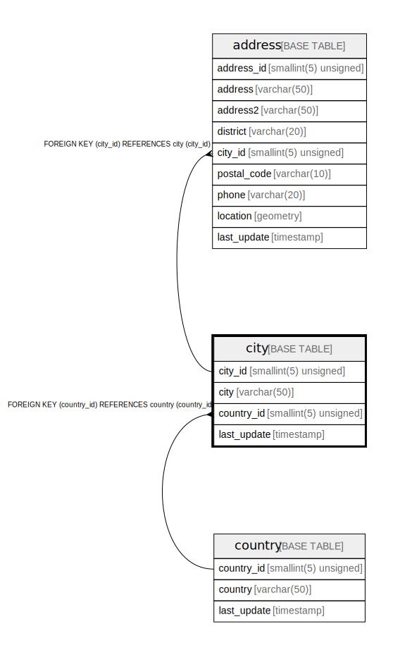

# city

## Description

<details>
<summary><strong>Table Definition</strong></summary>

```sql
CREATE TABLE `city` (
  `city_id` smallint(5) unsigned NOT NULL AUTO_INCREMENT,
  `city` varchar(50) NOT NULL,
  `country_id` smallint(5) unsigned NOT NULL,
  `last_update` timestamp NOT NULL DEFAULT CURRENT_TIMESTAMP ON UPDATE CURRENT_TIMESTAMP,
  PRIMARY KEY (`city_id`),
  KEY `idx_fk_country_id` (`country_id`),
  CONSTRAINT `fk_city_country` FOREIGN KEY (`country_id`) REFERENCES `country` (`country_id`) ON UPDATE CASCADE
) ENGINE=InnoDB AUTO_INCREMENT=[Redacted by tbls] DEFAULT CHARSET=utf8mb4
```

</details>

## Columns

| Name | Type | Default | Nullable | Extra Definition | Children | Parents | Comment |
| ---- | ---- | ------- | -------- | ---------------- | -------- | ------- | ------- |
| city_id | smallint(5) unsigned |  | false | auto_increment | [address](address.md) |  |  |
| city | varchar(50) |  | false |  |  |  |  |
| country_id | smallint(5) unsigned |  | false |  |  | [country](country.md) |  |
| last_update | timestamp | CURRENT_TIMESTAMP | false | on update CURRENT_TIMESTAMP |  |  |  |

## Constraints

| Name | Type | Definition |
| ---- | ---- | ---------- |
| fk_city_country | FOREIGN KEY | FOREIGN KEY (country_id) REFERENCES country (country_id) |
| PRIMARY | PRIMARY KEY | PRIMARY KEY (city_id) |

## Indexes

| Name | Definition |
| ---- | ---------- |
| idx_fk_country_id | KEY idx_fk_country_id (country_id) USING BTREE |
| PRIMARY | PRIMARY KEY (city_id) USING BTREE |

## Relations



---

> Generated by [tbls](https://github.com/k1LoW/tbls)
