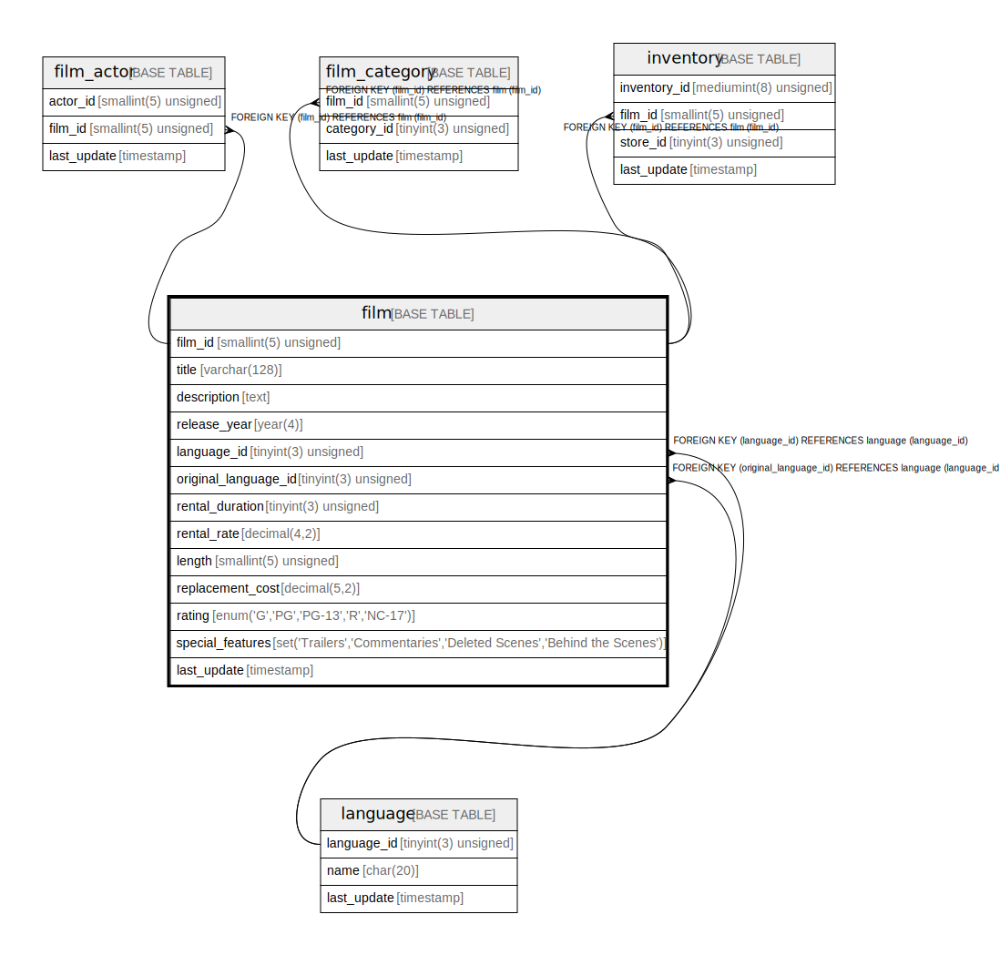

# film

## Description

<details>
<summary><strong>Table Definition</strong></summary>

```sql
CREATE TABLE `film` (
  `film_id` smallint(5) unsigned NOT NULL AUTO_INCREMENT,
  `title` varchar(128) NOT NULL,
  `description` text,
  `release_year` year(4) DEFAULT NULL,
  `language_id` tinyint(3) unsigned NOT NULL,
  `original_language_id` tinyint(3) unsigned DEFAULT NULL,
  `rental_duration` tinyint(3) unsigned NOT NULL DEFAULT '3',
  `rental_rate` decimal(4,2) NOT NULL DEFAULT '4.99',
  `length` smallint(5) unsigned DEFAULT NULL,
  `replacement_cost` decimal(5,2) NOT NULL DEFAULT '19.99',
  `rating` enum('G','PG','PG-13','R','NC-17') DEFAULT 'G',
  `special_features` set('Trailers','Commentaries','Deleted Scenes','Behind the Scenes') DEFAULT NULL,
  `last_update` timestamp NOT NULL DEFAULT CURRENT_TIMESTAMP ON UPDATE CURRENT_TIMESTAMP,
  PRIMARY KEY (`film_id`),
  KEY `idx_title` (`title`),
  KEY `idx_fk_language_id` (`language_id`),
  KEY `idx_fk_original_language_id` (`original_language_id`),
  CONSTRAINT `fk_film_language` FOREIGN KEY (`language_id`) REFERENCES `language` (`language_id`) ON UPDATE CASCADE,
  CONSTRAINT `fk_film_language_original` FOREIGN KEY (`original_language_id`) REFERENCES `language` (`language_id`) ON UPDATE CASCADE
) ENGINE=InnoDB AUTO_INCREMENT=[Redacted by tbls] DEFAULT CHARSET=utf8mb4
```

</details>

## Columns

| Name | Type | Default | Nullable | Extra Definition | Children | Parents | Comment |
| ---- | ---- | ------- | -------- | ---------------- | -------- | ------- | ------- |
| film_id | smallint(5) unsigned |  | false | auto_increment | [film_actor](film_actor.md) [film_category](film_category.md) [inventory](inventory.md) |  |  |
| title | varchar(128) |  | false |  |  |  |  |
| description | text |  | true |  |  |  |  |
| release_year | year(4) |  | true |  |  |  |  |
| language_id | tinyint(3) unsigned |  | false |  |  | [language](language.md) |  |
| original_language_id | tinyint(3) unsigned |  | true |  |  | [language](language.md) |  |
| rental_duration | tinyint(3) unsigned | 3 | false |  |  |  |  |
| rental_rate | decimal(4,2) | 4.99 | false |  |  |  |  |
| length | smallint(5) unsigned |  | true |  |  |  |  |
| replacement_cost | decimal(5,2) | 19.99 | false |  |  |  |  |
| rating | enum('G','PG','PG-13','R','NC-17') | G | true |  |  |  |  |
| special_features | set('Trailers','Commentaries','Deleted Scenes','Behind the Scenes') |  | true |  |  |  |  |
| last_update | timestamp | CURRENT_TIMESTAMP | false | on update CURRENT_TIMESTAMP |  |  |  |

## Constraints

| Name | Type | Definition |
| ---- | ---- | ---------- |
| fk_film_language | FOREIGN KEY | FOREIGN KEY (language_id) REFERENCES language (language_id) |
| fk_film_language_original | FOREIGN KEY | FOREIGN KEY (original_language_id) REFERENCES language (language_id) |
| PRIMARY | PRIMARY KEY | PRIMARY KEY (film_id) |

## Indexes

| Name | Definition |
| ---- | ---------- |
| idx_fk_language_id | KEY idx_fk_language_id (language_id) USING BTREE |
| idx_fk_original_language_id | KEY idx_fk_original_language_id (original_language_id) USING BTREE |
| idx_title | KEY idx_title (title) USING BTREE |
| PRIMARY | PRIMARY KEY (film_id) USING BTREE |

## Triggers

| Name | Definition |
| ---- | ---------- |
| ins_film | CREATE TRIGGER ins_film AFTER INSERT ON film<br>FOR EACH ROW<br>BEGIN<br>    INSERT INTO film_text (film_id, title, description)<br>        VALUES (new.film_id, new.title, new.description);<br>  END |
| upd_film | CREATE TRIGGER upd_film AFTER UPDATE ON film<br>FOR EACH ROW<br>BEGIN<br>    IF (old.title != new.title) OR (old.description != new.description) OR (old.film_id != new.film_id)<br>    THEN<br>        UPDATE film_text<br>            SET title=new.title,<br>                description=new.description,<br>                film_id=new.film_id<br>        WHERE film_id=old.film_id;<br>    END IF;<br>  END |
| del_film | CREATE TRIGGER del_film AFTER DELETE ON film<br>FOR EACH ROW<br>BEGIN<br>    DELETE FROM film_text WHERE film_id = old.film_id;<br>  END |

## Relations



---

> Generated by [tbls](https://github.com/k1LoW/tbls)
