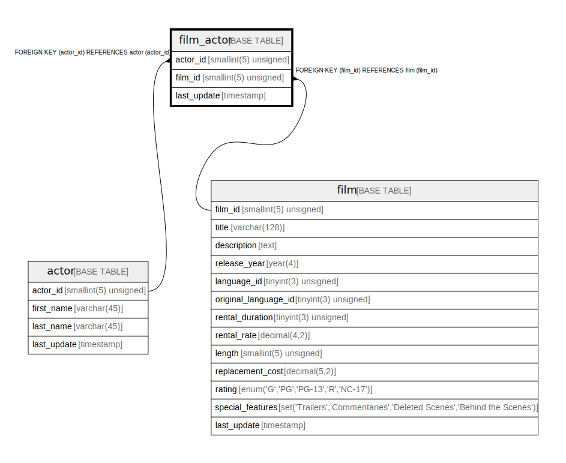

# film_actor

## Description

<details>
<summary><strong>Table Definition</strong></summary>

```sql
CREATE TABLE `film_actor` (
  `actor_id` smallint(5) unsigned NOT NULL,
  `film_id` smallint(5) unsigned NOT NULL,
  `last_update` timestamp NOT NULL DEFAULT CURRENT_TIMESTAMP ON UPDATE CURRENT_TIMESTAMP,
  PRIMARY KEY (`actor_id`,`film_id`),
  KEY `idx_fk_film_id` (`film_id`),
  CONSTRAINT `fk_film_actor_actor` FOREIGN KEY (`actor_id`) REFERENCES `actor` (`actor_id`) ON UPDATE CASCADE,
  CONSTRAINT `fk_film_actor_film` FOREIGN KEY (`film_id`) REFERENCES `film` (`film_id`) ON UPDATE CASCADE
) ENGINE=InnoDB DEFAULT CHARSET=utf8mb4
```

</details>

## Columns

| Name | Type | Default | Nullable | Extra Definition | Children | Parents | Comment |
| ---- | ---- | ------- | -------- | ---------------- | -------- | ------- | ------- |
| actor_id | smallint(5) unsigned |  | false |  |  | [actor](actor.md) |  |
| film_id | smallint(5) unsigned |  | false |  |  | [film](film.md) |  |
| last_update | timestamp | CURRENT_TIMESTAMP | false | on update CURRENT_TIMESTAMP |  |  |  |

## Constraints

| Name | Type | Definition |
| ---- | ---- | ---------- |
| fk_film_actor_actor | FOREIGN KEY | FOREIGN KEY (actor_id) REFERENCES actor (actor_id) |
| fk_film_actor_film | FOREIGN KEY | FOREIGN KEY (film_id) REFERENCES film (film_id) |
| PRIMARY | PRIMARY KEY | PRIMARY KEY (actor_id, film_id) |

## Indexes

| Name | Definition |
| ---- | ---------- |
| idx_fk_film_id | KEY idx_fk_film_id (film_id) USING BTREE |
| PRIMARY | PRIMARY KEY (actor_id, film_id) USING BTREE |

## Relations



---

> Generated by [tbls](https://github.com/k1LoW/tbls)
