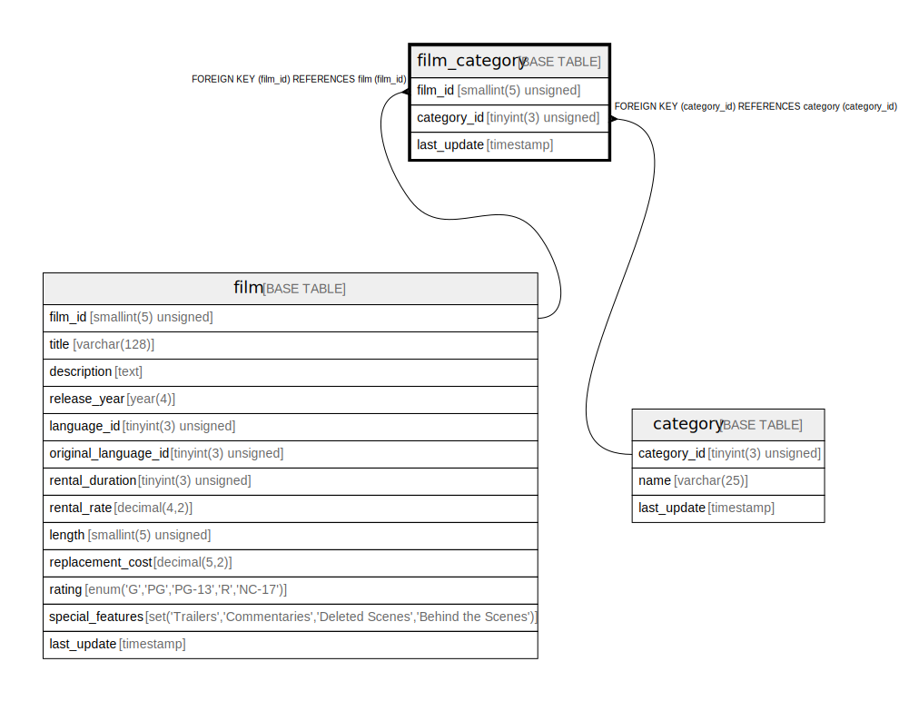

# film_category

## Description

<details>
<summary><strong>Table Definition</strong></summary>

```sql
CREATE TABLE `film_category` (
  `film_id` smallint(5) unsigned NOT NULL,
  `category_id` tinyint(3) unsigned NOT NULL,
  `last_update` timestamp NOT NULL DEFAULT CURRENT_TIMESTAMP ON UPDATE CURRENT_TIMESTAMP,
  PRIMARY KEY (`film_id`,`category_id`),
  KEY `fk_film_category_category` (`category_id`),
  CONSTRAINT `fk_film_category_category` FOREIGN KEY (`category_id`) REFERENCES `category` (`category_id`) ON UPDATE CASCADE,
  CONSTRAINT `fk_film_category_film` FOREIGN KEY (`film_id`) REFERENCES `film` (`film_id`) ON UPDATE CASCADE
) ENGINE=InnoDB DEFAULT CHARSET=utf8mb4
```

</details>

## Columns

| Name | Type | Default | Nullable | Extra Definition | Children | Parents | Comment |
| ---- | ---- | ------- | -------- | ---------------- | -------- | ------- | ------- |
| film_id | smallint(5) unsigned |  | false |  |  | [film](film.md) |  |
| category_id | tinyint(3) unsigned |  | false |  |  | [category](category.md) |  |
| last_update | timestamp | CURRENT_TIMESTAMP | false | on update CURRENT_TIMESTAMP |  |  |  |

## Constraints

| Name | Type | Definition |
| ---- | ---- | ---------- |
| fk_film_category_category | FOREIGN KEY | FOREIGN KEY (category_id) REFERENCES category (category_id) |
| fk_film_category_film | FOREIGN KEY | FOREIGN KEY (film_id) REFERENCES film (film_id) |
| PRIMARY | PRIMARY KEY | PRIMARY KEY (film_id, category_id) |

## Indexes

| Name | Definition |
| ---- | ---------- |
| fk_film_category_category | KEY fk_film_category_category (category_id) USING BTREE |
| PRIMARY | PRIMARY KEY (film_id, category_id) USING BTREE |

## Relations



---

> Generated by [tbls](https://github.com/k1LoW/tbls)
