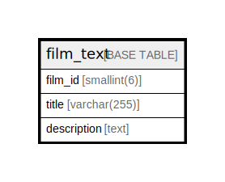

# film_text

## Description

<details>
<summary><strong>Table Definition</strong></summary>

```sql
CREATE TABLE `film_text` (
  `film_id` smallint(6) NOT NULL,
  `title` varchar(255) NOT NULL,
  `description` text,
  PRIMARY KEY (`film_id`),
  FULLTEXT KEY `idx_title_description` (`title`,`description`)
) ENGINE=InnoDB DEFAULT CHARSET=utf8mb4
```

</details>

## Columns

| Name | Type | Default | Nullable | Children | Parents | Comment |
| ---- | ---- | ------- | -------- | -------- | ------- | ------- |
| film_id | smallint(6) |  | false |  |  |  |
| title | varchar(255) |  | false |  |  |  |
| description | text |  | true |  |  |  |

## Constraints

| Name | Type | Definition |
| ---- | ---- | ---------- |
| PRIMARY | PRIMARY KEY | PRIMARY KEY (film_id) |

## Indexes

| Name | Definition |
| ---- | ---------- |
| idx_title_description | KEY idx_title_description (title, description) USING FULLTEXT |
| PRIMARY | PRIMARY KEY (film_id) USING BTREE |

## Relations



---

> Generated by [tbls](https://github.com/k1LoW/tbls)
