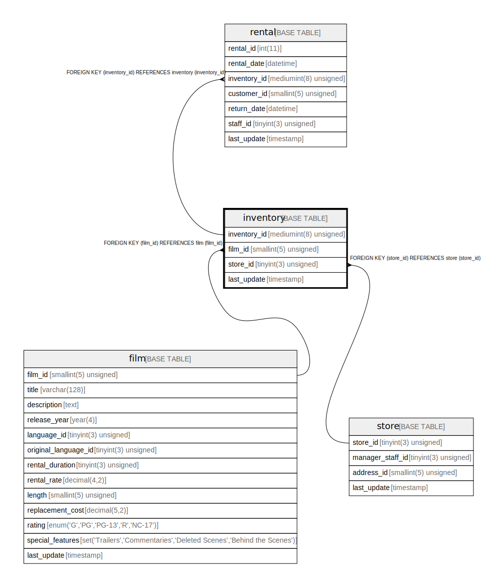

# inventory

## Description

<details>
<summary><strong>Table Definition</strong></summary>

```sql
CREATE TABLE `inventory` (
  `inventory_id` mediumint(8) unsigned NOT NULL AUTO_INCREMENT,
  `film_id` smallint(5) unsigned NOT NULL,
  `store_id` tinyint(3) unsigned NOT NULL,
  `last_update` timestamp NOT NULL DEFAULT CURRENT_TIMESTAMP ON UPDATE CURRENT_TIMESTAMP,
  PRIMARY KEY (`inventory_id`),
  KEY `idx_fk_film_id` (`film_id`),
  KEY `idx_store_id_film_id` (`store_id`,`film_id`),
  CONSTRAINT `fk_inventory_film` FOREIGN KEY (`film_id`) REFERENCES `film` (`film_id`) ON UPDATE CASCADE,
  CONSTRAINT `fk_inventory_store` FOREIGN KEY (`store_id`) REFERENCES `store` (`store_id`) ON UPDATE CASCADE
) ENGINE=InnoDB AUTO_INCREMENT=[Redacted by tbls] DEFAULT CHARSET=utf8mb4
```

</details>

## Columns

| Name | Type | Default | Nullable | Extra Definition | Children | Parents | Comment |
| ---- | ---- | ------- | -------- | ---------------- | -------- | ------- | ------- |
| inventory_id | mediumint(8) unsigned |  | false | auto_increment | [rental](rental.md) |  |  |
| film_id | smallint(5) unsigned |  | false |  |  | [film](film.md) |  |
| store_id | tinyint(3) unsigned |  | false |  |  | [store](store.md) |  |
| last_update | timestamp | CURRENT_TIMESTAMP | false | on update CURRENT_TIMESTAMP |  |  |  |

## Constraints

| Name | Type | Definition |
| ---- | ---- | ---------- |
| fk_inventory_film | FOREIGN KEY | FOREIGN KEY (film_id) REFERENCES film (film_id) |
| fk_inventory_store | FOREIGN KEY | FOREIGN KEY (store_id) REFERENCES store (store_id) |
| PRIMARY | PRIMARY KEY | PRIMARY KEY (inventory_id) |

## Indexes

| Name | Definition |
| ---- | ---------- |
| idx_fk_film_id | KEY idx_fk_film_id (film_id) USING BTREE |
| idx_store_id_film_id | KEY idx_store_id_film_id (store_id, film_id) USING BTREE |
| PRIMARY | PRIMARY KEY (inventory_id) USING BTREE |

## Relations



---

> Generated by [tbls](https://github.com/k1LoW/tbls)
