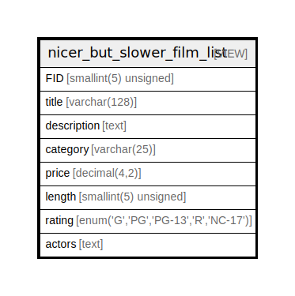

# nicer_but_slower_film_list

## Description

VIEW

<details>
<summary><strong>Table Definition</strong></summary>

```sql
CREATE VIEW nicer_but_slower_film_list AS (select `sakila`.`film`.`film_id` AS `FID`,`sakila`.`film`.`title` AS `title`,`sakila`.`film`.`description` AS `description`,`sakila`.`category`.`name` AS `category`,`sakila`.`film`.`rental_rate` AS `price`,`sakila`.`film`.`length` AS `length`,`sakila`.`film`.`rating` AS `rating`,group_concat(concat(concat(upper(substr(`sakila`.`actor`.`first_name`,1,1)),lower(substr(`sakila`.`actor`.`first_name`,2,length(`sakila`.`actor`.`first_name`))),' ',concat(upper(substr(`sakila`.`actor`.`last_name`,1,1)),lower(substr(`sakila`.`actor`.`last_name`,2,length(`sakila`.`actor`.`last_name`)))))) separator ', ') AS `actors` from ((((`sakila`.`category` left join `sakila`.`film_category` on((`sakila`.`category`.`category_id` = `sakila`.`film_category`.`category_id`))) left join `sakila`.`film` on((`sakila`.`film_category`.`film_id` = `sakila`.`film`.`film_id`))) join `sakila`.`film_actor` on((`sakila`.`film`.`film_id` = `sakila`.`film_actor`.`film_id`))) join `sakila`.`actor` on((`sakila`.`film_actor`.`actor_id` = `sakila`.`actor`.`actor_id`))) group by `sakila`.`film`.`film_id`,`sakila`.`category`.`name`)
```

</details>

## Referenced Tables

- [category](category.md)
- [film_category](film_category.md)
- [film](film.md)
- [film_actor](film_actor.md)
- [actor](actor.md)

## Columns

| Name | Type | Default | Nullable | Children | Parents | Comment |
| ---- | ---- | ------- | -------- | -------- | ------- | ------- |
| FID | smallint(5) unsigned | 0 | true |  |  |  |
| title | varchar(128) |  | true |  |  |  |
| description | text |  | true |  |  |  |
| category | varchar(25) |  | false |  |  |  |
| price | decimal(4,2) | 4.99 | true |  |  |  |
| length | smallint(5) unsigned |  | true |  |  |  |
| rating | enum('G','PG','PG-13','R','NC-17') | G | true |  |  |  |
| actors | text |  | true |  |  |  |

## Relations



---

> Generated by [tbls](https://github.com/k1LoW/tbls)
