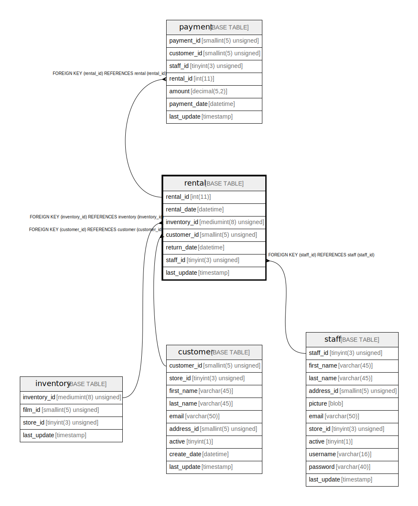

# rental

## Description

<details>
<summary><strong>Table Definition</strong></summary>

```sql
CREATE TABLE `rental` (
  `rental_id` int(11) NOT NULL AUTO_INCREMENT,
  `rental_date` datetime NOT NULL,
  `inventory_id` mediumint(8) unsigned NOT NULL,
  `customer_id` smallint(5) unsigned NOT NULL,
  `return_date` datetime DEFAULT NULL,
  `staff_id` tinyint(3) unsigned NOT NULL,
  `last_update` timestamp NOT NULL DEFAULT CURRENT_TIMESTAMP ON UPDATE CURRENT_TIMESTAMP,
  PRIMARY KEY (`rental_id`),
  UNIQUE KEY `rental_date` (`rental_date`,`inventory_id`,`customer_id`),
  KEY `idx_fk_inventory_id` (`inventory_id`),
  KEY `idx_fk_customer_id` (`customer_id`),
  KEY `idx_fk_staff_id` (`staff_id`),
  CONSTRAINT `fk_rental_customer` FOREIGN KEY (`customer_id`) REFERENCES `customer` (`customer_id`) ON UPDATE CASCADE,
  CONSTRAINT `fk_rental_inventory` FOREIGN KEY (`inventory_id`) REFERENCES `inventory` (`inventory_id`) ON UPDATE CASCADE,
  CONSTRAINT `fk_rental_staff` FOREIGN KEY (`staff_id`) REFERENCES `staff` (`staff_id`) ON UPDATE CASCADE
) ENGINE=InnoDB AUTO_INCREMENT=[Redacted by tbls] DEFAULT CHARSET=utf8mb4
```

</details>

## Columns

| Name | Type | Default | Nullable | Extra Definition | Children | Parents | Comment |
| ---- | ---- | ------- | -------- | ---------------- | -------- | ------- | ------- |
| rental_id | int(11) |  | false | auto_increment | [payment](payment.md) |  |  |
| rental_date | datetime |  | false |  |  |  |  |
| inventory_id | mediumint(8) unsigned |  | false |  |  | [inventory](inventory.md) |  |
| customer_id | smallint(5) unsigned |  | false |  |  | [customer](customer.md) |  |
| return_date | datetime |  | true |  |  |  |  |
| staff_id | tinyint(3) unsigned |  | false |  |  | [staff](staff.md) |  |
| last_update | timestamp | CURRENT_TIMESTAMP | false | on update CURRENT_TIMESTAMP |  |  |  |

## Constraints

| Name | Type | Definition |
| ---- | ---- | ---------- |
| fk_rental_customer | FOREIGN KEY | FOREIGN KEY (customer_id) REFERENCES customer (customer_id) |
| fk_rental_inventory | FOREIGN KEY | FOREIGN KEY (inventory_id) REFERENCES inventory (inventory_id) |
| fk_rental_staff | FOREIGN KEY | FOREIGN KEY (staff_id) REFERENCES staff (staff_id) |
| PRIMARY | PRIMARY KEY | PRIMARY KEY (rental_id) |
| rental_date | UNIQUE | UNIQUE KEY rental_date (rental_date, inventory_id, customer_id) |

## Indexes

| Name | Definition |
| ---- | ---------- |
| idx_fk_customer_id | KEY idx_fk_customer_id (customer_id) USING BTREE |
| idx_fk_inventory_id | KEY idx_fk_inventory_id (inventory_id) USING BTREE |
| idx_fk_staff_id | KEY idx_fk_staff_id (staff_id) USING BTREE |
| PRIMARY | PRIMARY KEY (rental_id) USING BTREE |
| rental_date | UNIQUE KEY rental_date (rental_date, inventory_id, customer_id) USING BTREE |

## Triggers

| Name | Definition |
| ---- | ---------- |
| rental_date | CREATE TRIGGER rental_date BEFORE INSERT ON rental<br>FOR EACH ROW<br>SET NEW.rental_date = NOW() |

## Relations



---

> Generated by [tbls](https://github.com/k1LoW/tbls)
