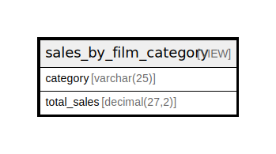

# sales_by_film_category

## Description

VIEW

<details>
<summary><strong>Table Definition</strong></summary>

```sql
CREATE VIEW sales_by_film_category AS (select `c`.`name` AS `category`,sum(`p`.`amount`) AS `total_sales` from (((((`sakila`.`payment` `p` join `sakila`.`rental` `r` on((`p`.`rental_id` = `r`.`rental_id`))) join `sakila`.`inventory` `i` on((`r`.`inventory_id` = `i`.`inventory_id`))) join `sakila`.`film` `f` on((`i`.`film_id` = `f`.`film_id`))) join `sakila`.`film_category` `fc` on((`f`.`film_id` = `fc`.`film_id`))) join `sakila`.`category` `c` on((`fc`.`category_id` = `c`.`category_id`))) group by `c`.`name` order by `total_sales` desc)
```

</details>

## Referenced Tables

- [payment](payment.md)
- [rental](rental.md)
- [inventory](inventory.md)
- [film](film.md)
- [film_category](film_category.md)
- [category](category.md)

## Columns

| Name | Type | Default | Nullable | Children | Parents | Comment |
| ---- | ---- | ------- | -------- | -------- | ------- | ------- |
| category | varchar(25) |  | false |  |  |  |
| total_sales | decimal(27,2) |  | true |  |  |  |

## Relations



---

> Generated by [tbls](https://github.com/k1LoW/tbls)
