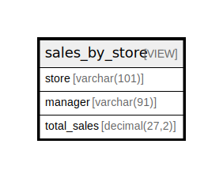

# sales_by_store

## Description

VIEW

<details>
<summary><strong>Table Definition</strong></summary>

```sql
CREATE VIEW sales_by_store AS (select concat(`c`.`city`,',',`cy`.`country`) AS `store`,concat(`m`.`first_name`,' ',`m`.`last_name`) AS `manager`,sum(`p`.`amount`) AS `total_sales` from (((((((`sakila`.`payment` `p` join `sakila`.`rental` `r` on((`p`.`rental_id` = `r`.`rental_id`))) join `sakila`.`inventory` `i` on((`r`.`inventory_id` = `i`.`inventory_id`))) join `sakila`.`store` `s` on((`i`.`store_id` = `s`.`store_id`))) join `sakila`.`address` `a` on((`s`.`address_id` = `a`.`address_id`))) join `sakila`.`city` `c` on((`a`.`city_id` = `c`.`city_id`))) join `sakila`.`country` `cy` on((`c`.`country_id` = `cy`.`country_id`))) join `sakila`.`staff` `m` on((`s`.`manager_staff_id` = `m`.`staff_id`))) group by `s`.`store_id` order by `cy`.`country`,`c`.`city`)
```

</details>

## Referenced Tables

- [payment](payment.md)
- [rental](rental.md)
- [inventory](inventory.md)
- [store](store.md)
- [address](address.md)
- [city](city.md)
- [country](country.md)
- [staff](staff.md)

## Columns

| Name | Type | Default | Nullable | Children | Parents | Comment |
| ---- | ---- | ------- | -------- | -------- | ------- | ------- |
| store | varchar(101) |  | true |  |  |  |
| manager | varchar(91) |  | true |  |  |  |
| total_sales | decimal(27,2) |  | true |  |  |  |

## Relations



---

> Generated by [tbls](https://github.com/k1LoW/tbls)
