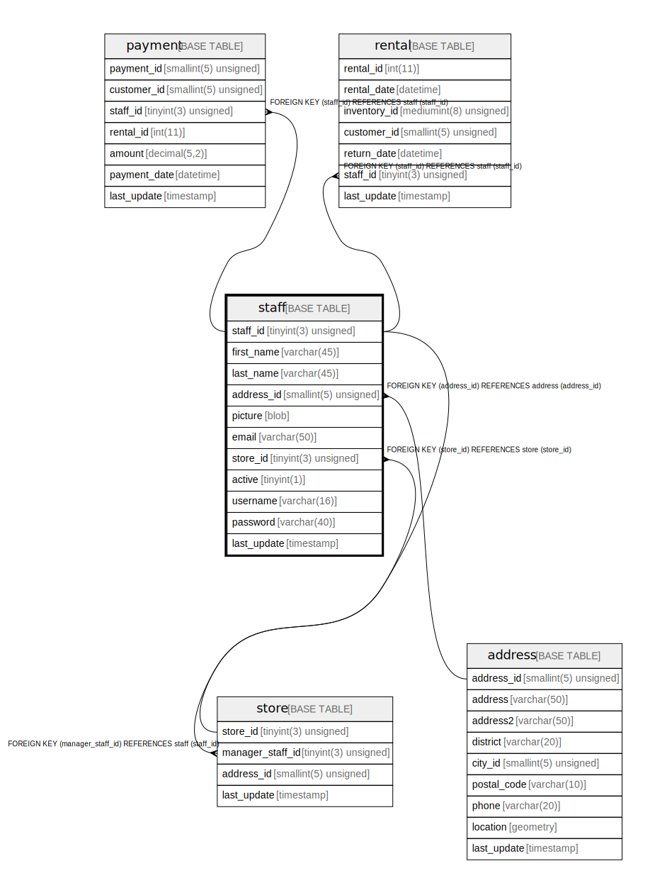

# staff

## Description

<details>
<summary><strong>Table Definition</strong></summary>

```sql
CREATE TABLE `staff` (
  `staff_id` tinyint(3) unsigned NOT NULL AUTO_INCREMENT,
  `first_name` varchar(45) NOT NULL,
  `last_name` varchar(45) NOT NULL,
  `address_id` smallint(5) unsigned NOT NULL,
  `picture` blob,
  `email` varchar(50) DEFAULT NULL,
  `store_id` tinyint(3) unsigned NOT NULL,
  `active` tinyint(1) NOT NULL DEFAULT '1',
  `username` varchar(16) NOT NULL,
  `password` varchar(40) CHARACTER SET utf8mb4 COLLATE utf8mb4_bin DEFAULT NULL,
  `last_update` timestamp NOT NULL DEFAULT CURRENT_TIMESTAMP ON UPDATE CURRENT_TIMESTAMP,
  PRIMARY KEY (`staff_id`),
  KEY `idx_fk_store_id` (`store_id`),
  KEY `idx_fk_address_id` (`address_id`),
  CONSTRAINT `fk_staff_address` FOREIGN KEY (`address_id`) REFERENCES `address` (`address_id`) ON UPDATE CASCADE,
  CONSTRAINT `fk_staff_store` FOREIGN KEY (`store_id`) REFERENCES `store` (`store_id`) ON UPDATE CASCADE
) ENGINE=InnoDB AUTO_INCREMENT=[Redacted by tbls] DEFAULT CHARSET=utf8mb4
```

</details>

## Columns

| Name | Type | Default | Nullable | Extra Definition | Children | Parents | Comment |
| ---- | ---- | ------- | -------- | ---------------- | -------- | ------- | ------- |
| staff_id | tinyint(3) unsigned |  | false | auto_increment | [payment](payment.md) [rental](rental.md) [store](store.md) |  |  |
| first_name | varchar(45) |  | false |  |  |  |  |
| last_name | varchar(45) |  | false |  |  |  |  |
| address_id | smallint(5) unsigned |  | false |  |  | [address](address.md) |  |
| picture | blob |  | true |  |  |  |  |
| email | varchar(50) |  | true |  |  |  |  |
| store_id | tinyint(3) unsigned |  | false |  |  | [store](store.md) |  |
| active | tinyint(1) | 1 | false |  |  |  |  |
| username | varchar(16) |  | false |  |  |  |  |
| password | varchar(40) |  | true |  |  |  |  |
| last_update | timestamp | CURRENT_TIMESTAMP | false | on update CURRENT_TIMESTAMP |  |  |  |

## Constraints

| Name | Type | Definition |
| ---- | ---- | ---------- |
| fk_staff_address | FOREIGN KEY | FOREIGN KEY (address_id) REFERENCES address (address_id) |
| fk_staff_store | FOREIGN KEY | FOREIGN KEY (store_id) REFERENCES store (store_id) |
| PRIMARY | PRIMARY KEY | PRIMARY KEY (staff_id) |

## Indexes

| Name | Definition |
| ---- | ---------- |
| idx_fk_address_id | KEY idx_fk_address_id (address_id) USING BTREE |
| idx_fk_store_id | KEY idx_fk_store_id (store_id) USING BTREE |
| PRIMARY | PRIMARY KEY (staff_id) USING BTREE |

## Relations



---

> Generated by [tbls](https://github.com/k1LoW/tbls)
